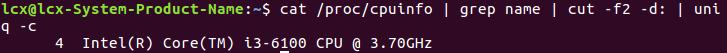
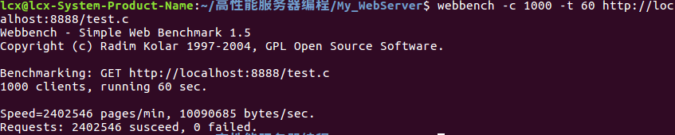
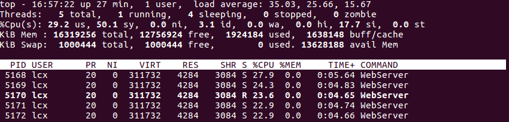
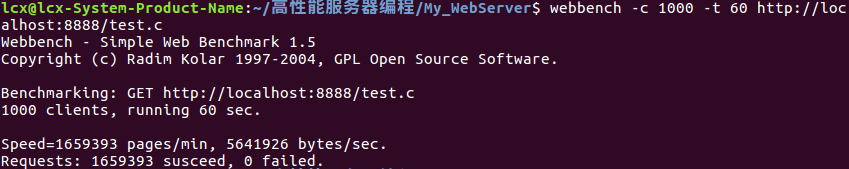
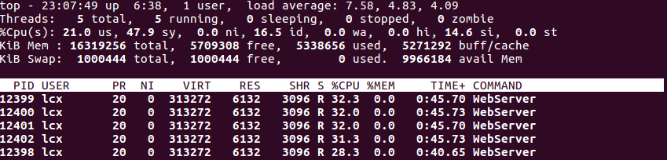

# 并发测试

### 1、测试环境

- 测试环境：台式机，本地，CPU信息如下

  

- 测试工具：Webbench，1000并发连接，时间60s

### 2、测试结果

- ​	短连接，不加定时器，线程池大小为4 	**(top -c : 查看所有的) （top -H -p 12398 查看指定进程，还能把该进程中所有线程放出了）**

  

  

- 短连接，加定时器，线程池大小为4

  

  

- 

  